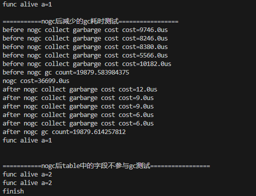
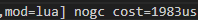
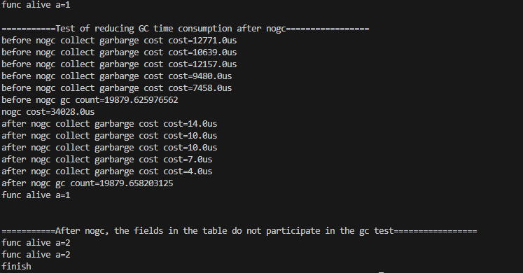

# Lua-Nogc-Table


[English Document](#2)

## 功能

- 将Lua表从gc的各个流程中剔除，可选拒绝该表的修改和添加
- 可用于减少GC消耗，例如Lua配置表过大时，这种表一般常驻且只读，可调用该nogc函数。
- 对lua源码的侵入非常少

## 目录

- luasrc文件夹下存放完整的Lua源文件（版本5.4.4）
- Test文件下存放测试工程

## 使用

开发和测试基于5.4.4版本。<br><br>
其他lua版本使用时，按以下步骤
1. 在luasrc文件夹中的xnogc.cpp和xnogc.h放到lua源文件目录下
2. 将lgc.c中的traversetable函数用下面的函数替代
```c
/* 添加了一个skiptable的判断 */
static lu_mem traversetable (global_State *g, Table *h) {
  const char *weakkey, *weakvalue, *skiptable;
  const TValue *mode = gfasttm(g, h->metatable, TM_MODE);
  markobjectN(g, h->metatable);
  if (mode && ttisstring(mode) &&  /* is there a weak mode? */
      (cast_void(weakkey = strchr(svalue(mode), 'k')),
       cast_void(weakvalue = strchr(svalue(mode), 'v')),
       cast_void(skiptable = strchr(svalue(mode), 's')),
       (weakkey || weakvalue || skiptable))) {  /* is really weak? */ /* is skip table? */
    if (skiptable) goto END;
    if (!weakkey)  /* strong keys? */
      traverseweakvalue(g, h);
    else if (!weakvalue)  /* strong values? */
      traverseephemeron(g, h, 0);
    else  /* all weak */
      linkgclist(h, g->allweak);  /* nothing to traverse now */
  }
  else  /* not weak */
    traversestrongtable(g, h);
  END:
  return 1 + h->alimit + 2 * allocsizenode(h);
}
```
3. 在你的main函数中引用xnogc.h头文件并调用**luaL_opengclibs(L)**

## 测试工程
1. Test目录下存放了简单的测试工程
2. build-win和build-linux目录下存放测试的可执行程序和lua文件
3. 编译 linux执行 **./build.sh** windows下执行 **build.cmd**
4. 运行(linux)
```bash
./Test
```

## 效果
- 一个table，包含一个function，以及数组长度5万，每个包含一个数字和字符串，hashkey个数5万，每个包含一个数字和字符串，调用nogc测试结果<br>

- 在正式项目，对一个物品配置表调用nogc耗时<br>


## 如何让Table只读
1. 如果希望表同时为只读，不允许修改插入，按以下修改
1.1 在lvm.h文件中，添加下面的宏
```c
/*
* @xuyao
* check table is writeable
*/
#define checktw(L, t) if((void*)(t->gclist)==(void*)(0xFFFFFFFFFFFFFFFF)) luaL_error(L, "can't modify")
#define checkgctw(L, o) checktw(L, gco2t(o))
#define checkvtw(L, t)  checkgctw(L, gcvalue(t))
```
1.2 在lvm.h文件中，修改luaV_finishfastset宏为
```c
#define luaV_finishfastset(L,t,slot,v) \
    { checkvtw(L, t);\
      setobj2t(L, cast(TValue *,slot), v); \
      luaC_barrierback(L, gcvalue(t), v); }
```
1.3 在所有调用setobj2t宏的上方添加checktw(L, t)，以下为5.4.4版本中添加的位置
```c
/* 
lvm.c:1806
*/
checktw(L, h);
setobj2t(L, &h->array[last - 1], val);

/*
ltable.c:716
*/
  checktw(L, t);
  setobj2t(L, gval(mp), value);

/*
ltable.c:816
*/
      checktw(L, t);
      setobj2t(L, cast(TValue*, slot), value);

/*
ltable.c:841
*/
      checktw(L, t);
      setobj2t(L, cast(TValue*, p), value);
```

## lua使用实例

- 只有一个表时
```lua
nogc(t)
```

- 有多个表时
```lua
--[[
--如果多个表内容都很多，可以预留空间来加快nogc的调用速度，填一个预估的所有表的字段个数
--下面为5个表格，每个表格有1万个子表，每个子表有两个元素时的大小
nogcreserve(5*10000*2)
--]]
--多个表格时仍然可以每个表格调用一次nogc函数，只是在表格数多时以下方式调用更快
awaitnogc(t0)
awaitnogc(t1)
awaitnogc(t2)
awaitnogc(t3)
awaitnogc(t4)
firenogc()
```
> test文件夹中的test.lua为示例，命令行运行**nogc**可用来测试

<p id="2"></p>

# English Document

## Feature

- Remove the Lua table from each gc process, and optionally reject the modification and addition of the table.
- It can be used to reduce GC consumption. For example, when the Lua configuration table is too large, this table is generally resident and read-only, and the nogc function can be called.
- There is very little intrusion into Lua source code

## Document

- The complete Lua source files (version 5.4.4) are stored in the **luasrc** folder
- Test project is stored in the Test file

## Usage

Development and testing are based on version 5.4.4. <br><br>
When using other Lua versions, follow the steps below
1. Place xnogc.cpp and xnogc.h in the luasrc folder into the lua source file directory
2. Replace the traversetable function in lgc.c with the following function
```c
/* Added a skiptable judgment */
static lu_mem traversetable (global_State *g, Table *h) {
  const char *weakkey, *weakvalue, *skiptable;
  const TValue *mode = gfasttm(g, h->metatable, TM_MODE);
  markobjectN(g, h->metatable);
  if (mode && ttisstring(mode) &&  /* is there a weak mode? */
      (cast_void(weakkey = strchr(svalue(mode), 'k')),
       cast_void(weakvalue = strchr(svalue(mode), 'v')),
       cast_void(skiptable = strchr(svalue(mode), 's')),
       (weakkey || weakvalue || skiptable))) {  /* is really weak? */ /* is skip table? */
    if (skiptable) goto END;
    if (!weakkey)  /* strong keys? */
      traverseweakvalue(g, h);
    else if (!weakvalue)  /* strong values? */
      traverseephemeron(g, h, 0);
    else  /* all weak */
      linkgclist(h, g->allweak);  /* nothing to traverse now */
  }
  else  /* not weak */
    traversestrongtable(g, h);
  END:
  return 1 + h->alimit + 2 * allocsizenode(h);
}
```

3. In your main function, include the xnogc.h header file and call **luaL_opengclibs(L)**

## Test Project
1. The Test directory stores simple test project
2. The build-win and build-linux directories store test executable programs and lua files
3. Compile linux execute **./build.sh** windows execute **build.cmd**
4. Run (linux)
```bash
./Test
```

## Performance
- A table, containing a function, and an array length of 50,000, each containing a number and a string, 50,000 hashkeys, each containing a number and a string. Called nogc test results<br>

- In a formal project, calling nogc on an item configuration table takes time<br>


## How to make a Table read-only

1. If you want the table to be read-only at the same time and do not allow modification and insertion, modify it as follows
1.1 In the lvm.h file, add the following macro
```c
/*
* @xuyao
* check table is writeable
*/
#define checktw(L, t) if((void*)(t->gclist)==(void*)(0xFFFFFFFFFFFFFFFF)) luaL_error(L, "can't modify")
#define checkgctw(L, o) checktw(L, gco2t(o))
#define checkvtw(L, t)  checkgctw(L, gcvalue(t))
```
1.2 In the lvm.h file, modify the luaV_finishfastset macro to
```c
#define luaV_finishfastset(L,t,slot,v) \
    { checkvtw(L, t);\
      setobj2t(L, cast(TValue *,slot), v); \
      luaC_barrierback(L, gcvalue(t), v); }
```
1.3 Add checktw(L, t) above all calls to the setobj2t macro. The following is the location added in version 5.4.4
```c
/* 
lvm.c:1806
*/
checktw(L, h);
setobj2t(L, &h->array[last - 1], val);

/*
ltable.c:716
*/
  checktw(L, t);
  setobj2t(L, gval(mp), value);

/*
ltable.c:816
*/
      checktw(L, t);
      setobj2t(L, cast(TValue*, slot), value);

/*
ltable.c:841
*/
      checktw(L, t);
      setobj2t(L, cast(TValue*, p), value);
```

## lua usage example

- When there is only one table
```lua
nogc(t)
```

- When there is multiple tables
```lua
--[[
--If multiple tables have a lot of content, you can reserve space to speed up the call of nogc and fill in an estimated number of fields for all tables.
--The following are 5 tables, each table has 10,000 sub-tables, and the size of each sub-table when there are two elements
nogcreserve(5*10000*2)
--]]
--When there are multiple tables, you can still call the nogc function once for each table, but it is faster to call it in the following way when there are many tables.
awaitnogc(t0)
awaitnogc(t1)
awaitnogc(t2)
awaitnogc(t3)
awaitnogc(t4)
firenogc()
```
> test.lua in the test folder is an example, and the command line can be used to run **nogc** for testing.
